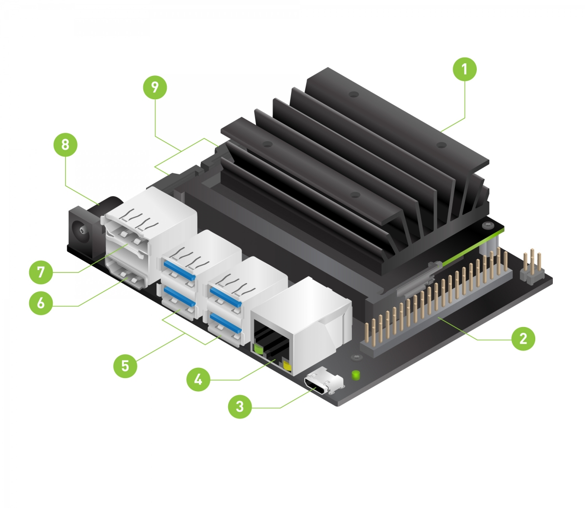
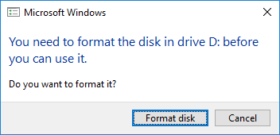
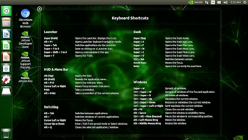
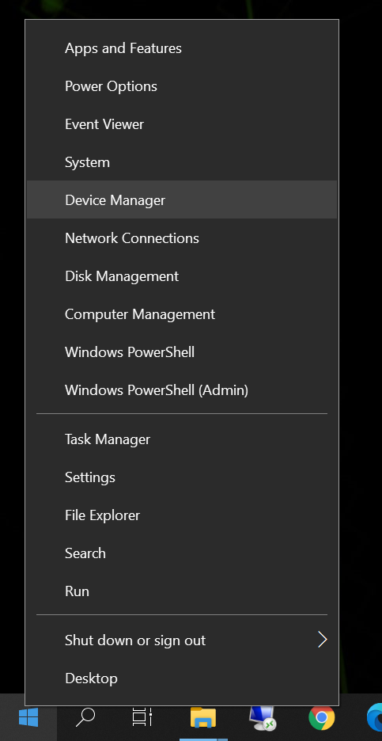
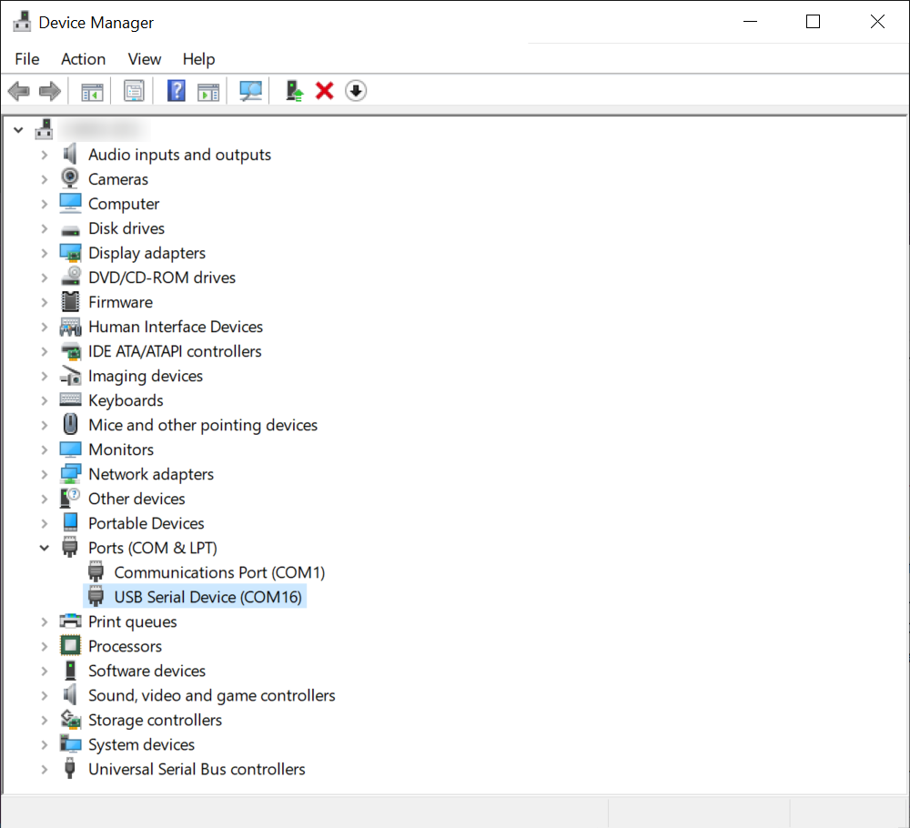
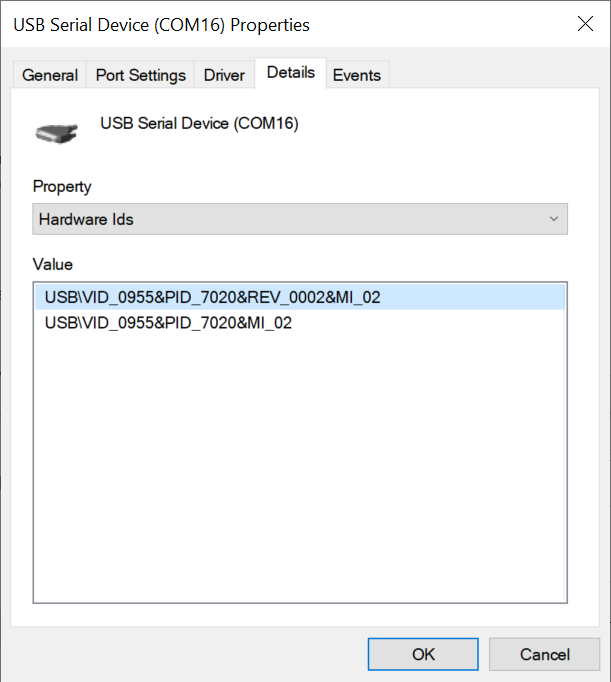
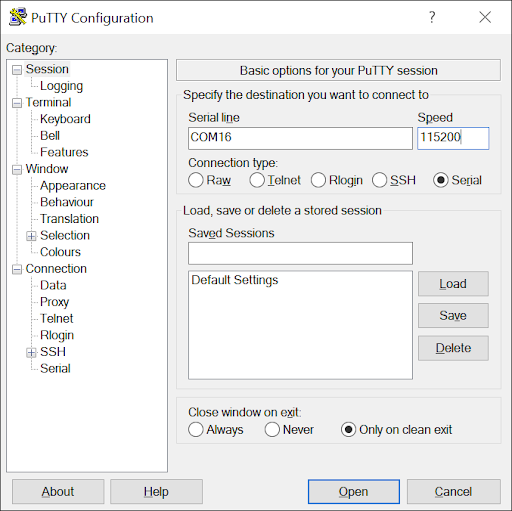
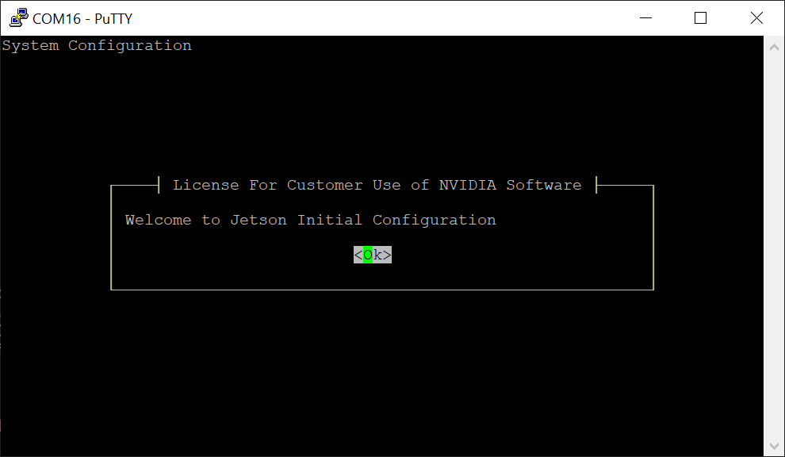

# Get Started With Jetson Nano Developer Kit

## Outline

- [Get Started With Jetson Nano Developer Kit](#get-started-with-jetson-nano-developer-kit)
  - [Outline](#outline)
- [Introduction](#introduction)
  - [Included in the Box](#included-in-the-box)
  - [Items not Included](#items-not-included)
- [Prepare for Setup](#prepare-for-setup)
  - [Items for Getting Started](#items-for-getting-started)
    - [microSD Card](#microsd-card)
    - [Micro-USB Power Supply](#micro-usb-power-supply)
- [Write Image to the microSD Card](#write-image-to-the-microsd-card)
- [Setup and First Boot](#setup-and-first-boot)
  - [Initial Setup with Display Attached](#initial-setup-with-display-attached)
    - [Setup Steps](#setup-steps)
    - [First Boot](#first-boot)
    - [After Logging In](#after-logging-in)
  - [Initial Setup Headless Mode](#initial-setup-headless-mode)
    - [Setup Steps](#setup-steps-1)
    - [First Boot](#first-boot-1)
    - [After Logging In](#after-logging-in-1)
- [Another Related Topics](#another-related-topics)

# Introduction

The [NVIDIA® Jetson Nano™ Developer Kit](https://developer.nvidia.com/embedded/buy/jetson-nano-devkit) is a small AI computer for makers, learners, and developers. After following along with this brief guide, you’ll be ready to start building practical AI applications, cool AI robots, and more.

<p align="center">

</p>

1. microSD card slot for main storage
2. 40-pin expansion header
3. Micro-USB port for 5V power input, or for Device Mode
4. Gigabit Ethernet port
5. USB 3.0 ports (x4)
6. HDMI output port
7. DisplayPort connector
8. DC Barrel jack for 5V power input
9. MIPI CSI-2 camera connectors

## Included in the Box

Your Jetson Nano Developer Kit box includes:

- NVIDIA Jetson module and reference carrier board
- Small paper card with quick start and support information
- Folded paper stand

## Items not Included

You’ll also need:

- microSD card (32GB UHS-1 minimum recommended)
- USB keyboard and mouse
- Computer display (HDMI or DP)
- Micro-USB power supply

> **Initially, a computer with Internet connection and the ability to flash your microSD card is also required.**

# Prepare for Setup

## Items for Getting Started

### microSD Card

The Jetson Nano Developer Kit uses a microSD card as a boot device and for main storage. It’s important to have a card that’s fast and large enough for your projects; the minimum recommended is a 32 GB UHS-1 card.

See the instructions below to flash your microSD card with operating system and software.

### Micro-USB Power Supply

You’ll need to power the developer kit with a good quality power supply that can deliver 5V⎓2A at the developer kit’s Micro-USB port. Not every power supply promising “5V⎓2A” will actually do this.

As an example of a good power supply, NVIDIA has validated Adafruit’s 5V 2.5A Switching Power Supply with 20AWG MicroUSB Cable (GEO151UB-6025). It was specifically designed to overcome common problems with USB power supplies; see the linked product page for details.

# Write Image to the microSD Card

To prepare your microSD card, you’ll need a computer with Internet connection and the ability to read and write SD cards, either via a built-in SD card slot or adapter.

1. Download the [Jetson Nano Developer Kit SD Card Image](https://developer.nvidia.com/jetson-nano-sd-card-image), and note where it was saved on the computer.
2. Write the image to your microSD card by following the instructions below according to your computer’s operating system: Windows, macOS, or Linux.

<details>
<summary><strong>INSTRUCTIONS FOR WINDOWS</strong></summary>

Format your microSD card using SD Memory Card Formatter from the SD Association.

<p align="center">

</p>

1. Download, install, and launch [SD Memory Card Formatter for Windows](https://www.sdcard.org/downloads/formatter_4/eula_windows/).
2. Select card drive
3. Select “Quick format”
4. Leave “Volume label” blank
5. Click “Format” to start formatting, and “Yes” on the warning dialog

Use Etcher to write the Jetson Nano Developer Kit SD Card Image to your microSD card

1. Download, install, and launch [Etcher](https://www.balena.io/etcher).
2. Click “Select image” and choose the zipped image file downloaded earlier.
3. Insert your microSD card if not already inserted.
   > Click Cancel (per [this explanation](https://github.com/balena-io/etcher/issues/2024)) if Windows prompts you with a dialog like this:

<p align="center">

</p>

4. Click “Select drive” and choose the correct device.

<p align="center">
</p>

5. Click “Flash!” It will take Etcher about 10 minutes to write and validate the image if your microSD card is connected via USB3.
6. After Etcher finishes, Windows may let you know it doesn’t know how to read the SD Card. Just click Cancel and remove the microSD card.

<p align="center">

</p>

After your microSD card is ready, proceed to [set up your developer kit](#setup-and-first-boot).

</details>

# Setup and First Boot

There are two ways to interact with the developer kit: 1) with display, keyboard and mouse attached, or 2) in “headless mode” via connection from another computer.

You can conduct the initial setup either way.

 <table>
  <tr>
    <th></th>
    <th>Initial setup with display attached</th>
    <th>Initial setup in headless mode</th>
  </tr>
  <tr>
    <td><strong>Monitor, keyboard and mouse</strong></td>
    <td>Required</td>
    <td>Not required</td>
  </tr>
  <tr>
    <td><strong>Extra computer</strong></td>
    <td>Not required</td>
    <td>Required</td>
  </tr>
  <tr>
    <td><strong>Power options</strong></td>
    <td>Either Micro-USB or DC power supply can be used</td>
    <td>DC power supply is needed</td>
  </tr>
</table>

## Initial Setup with Display Attached

<p align="center">

</p>

### Setup Steps

1. Unfold the paper stand and place inside the developer kit box.
2. Insert the microSD card (with system image already written to it) into the slot on the underside of the Jetson Nano module.

<p align="center">

</p>

3. Set the developer kit on top of the paper stand.
4. Power on your computer display and connect it.
5. Connect the USB keyboard and mouse.
6. Connect your Micro-USB power supply (or see the [Jetson Nano Developer Kit User Guide](https://developer.nvidia.com/embedded/downloads#?search=Jetson%20Nano%20Developer%20Kit%20User%20Guide) for details about using DC a power supply with a barrel jack connector). The developer kit will power on and boot automatically.

### First Boot

A green LED next to the Micro-USB connector will light as soon as the developer kit powers on. When you boot the first time, the developer kit will take you through some initial setup, including:

- Review and accept NVIDIA Jetson software EULA
- Select system language, keyboard layout, and time zone
- Create username, password, and computer name
- Select APP partition size—it is recommended to use the max size suggested

### After Logging In

You will see this screen. Congratulations!

<p align="center">

</p>

## Initial Setup Headless Mode

To complete setup when no display is attached to the developer kit, you’ll need to connect the developer kit to another computer and then communicate with it via a terminal application (e.g., PuTTY) to handle the USB serial communication on that other computer.

> **Note**: Headless initial configuration requires the developer kit to be powered by a DC power supply with barrel jack connector, since the Micro-USB port is required to access the initial configuration prompts.

### Setup Steps

1. Unfold the paper stand and place inside the developer kit box.
2. Insert the microSD card (with system image already written to it) into the slot on the underside of the Jetson Nano module.

<p align="center">

</p>

3. Set the developer kit on top of the paper stand.
4. Check the [Jetson Nano Developer Kit User Guide](https://developer.nvidia.com/embedded/downloads#?search=Jetson%20Nano%20Developer%20Kit%20User%20Guide) for location of J48 Power Select Header and J25 Power Jack.
5. Jumper the J48 Power Select Header pins.
6. Connect your other computer to the developer kit’s Micro-USB port.
7. Connect a DC power supply to the J25 Power Jack. The developer kit will power on automatically.
8. Allow 1 minute for the developer kit to boot.
9. On your other computer, use the serial terminal application to connect via host serial port to the developer kit.

<details>
<summary><strong>INSTRUCTIONS FOR WINDOWS</strong></summary>

<h3>Locate the correct COM port</h3>

Assuming you have already connected your Windows PC to the developer kit’s Micro-USB port, right click the Windows Start icon and select “Device Manager.”

<p align="center">

</p>

Open the “Ports (COM & LPT)” to find the COM port number for “USB Serial Device” (in this case “COM 16”)

<p align="center">

</p>

Double click each USB Serial Device entry so you can check its properties. Go to the “Details” tab, and select “Hardware Ids”. If you see VID 0955 and PID 7020, that USB Serial Device for your Jetson developer kit. Note the COM port name (COM16 in this example) for later use.

<p align="center">

</p>

<h3>Open the COM port on PuTTY</h3>

PuTTY is one of the most widely used terminal applications for accessing serial consoles. You can use other terminal applications, but if you don’t have any on your Windows PC, you can download PuTTY from [here](https://www.chiark.greenend.org.uk/~sgtatham/putty/latest.html).

Open the PuTTY application. When “Session” is selected in the left “Category” pane, input the COM port name for “Serial line” and “115200” for “Speed”.

<p align="center">

</p>

Click “Open” to connect to the console.

<p align="center">

</p>

</details>

<details>
<summary><strong>INSTRUCTIONS FOR MACOS</strong></summary>

<h3>Locate the tty device</h3>

Before connecting to your Jetson developer kit for initial setup, check to see what Serial devices are already shown on your macOS computer.

```sh
$ ls /dev/cu.usbmodem*
~$
```

Connect your macOS computer to the developer kit’s Micro-USB port and run the same command to find what’s newly added.

```sh
~$ ls /dev/cu.usbmodem\*
/dev/cu.usbmodem14133200001053
~$
```

The new serial device is for your Jetson developer kit.

```sh
~$ ls -l /dev/cu.usbmodem\*
crw-rw-rw- 1 root wheel 18, 19 Oct 2 03:54 /dev/cu.usbmodem14133200001053
~$
```

<h3>Screen command</h3>

Screen is already installed by default as part of macOS.

Use the device name discovered previously as a command line option for the `screen` command.

```sh
$ sudo screen /dev/cu.usbmodem14133200001053 115200
```

<h3>Terminate screen</h3>

To terminate your screen session, press `C-a + k` (`Ctrl` + `a`, then `k`), then press `y` on confirmation.

</details>

<details>
<summary><strong>INSTRUCTIONS FOR LINUX</strong></summary>

<h3>Locate the tty device</h3>

Before connecting to your Jetson developer kit for initial setup, check to see what Serial devices are already shown on your Linux computer.

```sh
$ dmesg | grep --color 'tty'
```

Connect your Linux computer to the developer kit’s Micro-USB port and run the same command to find what’s newly added.

```sh
$ dmesg | grep --color 'tty'
…
…
[xxxxxx.xxxxxx] cdc_acm 1-5:1.2: ttyACM0: USB ACM device
```

The new serial device is for your Jetson developer kit.

```sh
$ ls -l /dev/ttyACM0
crw-rw---- 1 root dialout 166, 0 Oct  2 02:45 /dev/ttyACM0
```

<h3>Screen command</h3>

Install the Screen program on your Linux computer if it is now already available. For example, use this command to install Screen if you are running Ubuntu.

```sh
$ sudo apt-get install -y screen
```

Use the device name discovered previously as a command line option for the `screen` command.

```sh
$ sudo screen /dev/ttyACM0 115200
```

<h3>Terminate screen</h3>

To terminate your screen session, press `C-a + k` (`Ctrl` + `a`, then `k`), then press `y` on confirmation.

</details>

Once connected to the developer kit, hit `SPACE` if the initial setup screen does not appear automatically.

### First Boot

A green LED next to the Micro-USB connector will light as soon as the developer kit powers on. When you boot the first time, the developer kit will take you through some initial setup, including:

- Review and accept NVIDIA Jetson software EULA
- Select system language, keyboard layout, and time zone
- Create username, password, and computer name
- Select APP partition size—it is recommended to use the max size suggested

### After Logging In

You will see a standard Linux command line prompt in your serial terminal application. Congratulations!

# Another Related Topics

- [Dedicated Cooling Fan for Jetson Nano 4020 PWM 5V 4-Pin](docs/waveshare/fan-4020-pwm-5v.md)
- [Enable / Disable UI in Jetson Nano](docs/jetson-nano/ui.md)
- [ArduCam: Nvidia Jetson Camera](docs/arducam/nvidia-jetson-camera.md)
