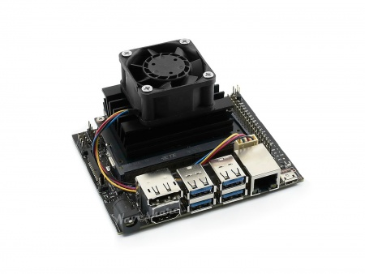

# Fan-4020-PWM-5V



## Introduction

Fan for Jetson Nano, support PWM controlling.

## How to use

### Hardware connection

Please connect the Fan to Fan interface of the Jetson Nano Developer Kit, note the direction.

### Software setting

Running fan: you can use the command below to run the fan in full speed.

```sh
sudo sh -c 'echo 255 > /sys/devices/pwm-fan/target_pwm'
```

> **Note**: You can change the 255 to another value (0~255) to change the speed of fan.

You can also set the fan ran when booting by creating and modifying `rc.local` file.

```sh
sudo vi /etc/rc.local
```

Add statements below to `rc.local` file and save.

```sh
#!/bin/bash
sleep 10
sudo /usr/bin/jetson_clocks
sudo sh -c 'echo 255 > /sys/devices/pwm-fan/target_pwm'
```

Modify file permission.

```sh
sudo chmod u+x rc.local
```

Then reboot and testing

```sh
sudo reboot
```

> **Note**: if you are strange with the vi editor, you can also install nano and use it for editing:

```sh
sudo apt-get install nano
sudo nano /etc/rc.local
```

## FAQ

**Question**: What functions do the four wires of Fan-4020-PWM-5V separately?

**Answer:**

`Black` -> GND; `Red` -> Vcc; `Blue` -> Tach; `Yellow` -> PWM

The color of Tach and PWM may be different among different batch, it is all to the actual products.
